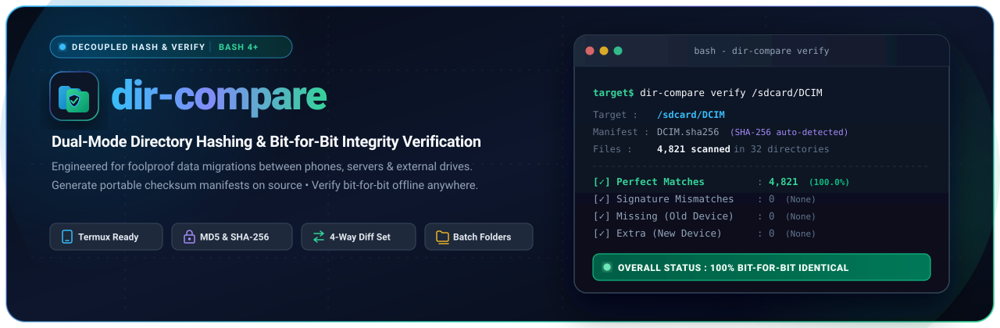
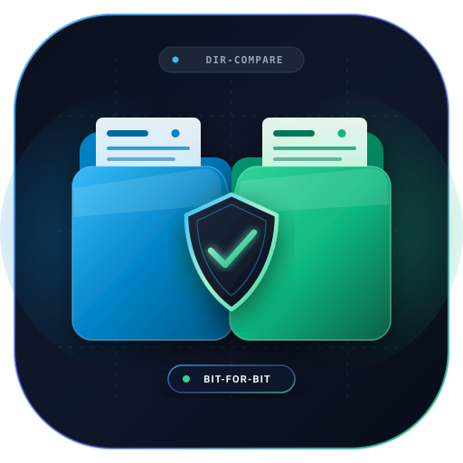
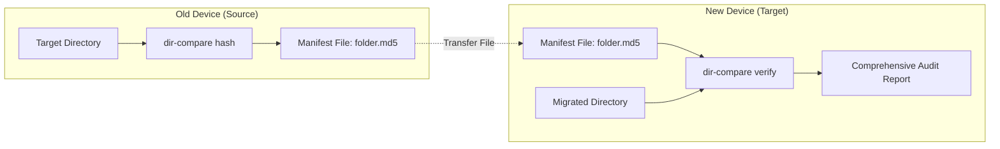

<p align="center">
  
</p>

<h1 align="center">dir-compare</h1>

<p align="center">
  <strong>Decoupled Directory Hashing &amp; Bit-for-Bit Integrity Verification</strong>
  <br>
  <a href="https://www.gnu.org/software/bash/"></a>
  <a href="#requirements"></a>
  <a href="LICENSE"></a>
</p>

<br>



**`dir-compare`** is a resilient, lightweight, dual-mode directory hashing and verification tool. Originally crafted to guarantee bit-for-bit integrity during **Android phone migrations**, it allows you to verify that thousands of photos, videos, music, and nested folders transfer completely across devices without missing, corrupted, or duplicate files.

Traditional comparison tools like `diff -r` require mounting both filesystems side-by-side. `dir-compare` **decouples the process**: create a portable checksum manifest on the source device, transfer the small manifest file, and verify it on the target device with a detailed integrity audit.

<br clear="right"/>

---

## Table of Contents

- [Key Features](#key-features)
- [How It Works](#how-it-works)
- [Requirements](#requirements)
- [Installation](#installation)
- [Quick Start](#quick-start)
- [Usage Guide](#usage-guide)
  - [1. Hashing Mode (Source Device)](#1-hashing-mode-source-device)
  - [2. Verification Mode (Target Device)](#2-verification-mode-target-device)
  - [3. Batch Multi-Directory Processing](#3-batch-multi-directory-processing)
- [End-to-End Phone Migration Guide](#end-to-end-phone-migration-guide)
- [Sample Verification Report](#sample-verification-report)
- [Exit Codes](#exit-codes)
- [Architecture & Design Details](#architecture--design-details)
- [License](#license)

---

## Key Features

- **⚡ Decoupled Hash & Verify**: Run hashing on your old device and verify on the new one independently—no live network or direct cable link needed during audit.
- **🔍 4-Way Differential Analysis**: Categorizes every file into:
  1. **Perfect Matches**: Identical paths and matching cryptographic checksums.
  2. **Signature Mismatches**: Files present on both devices but corrupted or modified in transit.
  3. **Missing Files (Source Only)**: Files recorded in the manifest that failed to transfer.
  4. **Extra Files (Target Only)**: Unexpected files found on the destination that were not in the original directory.
- **📁 Multi-Directory Batching**: Hash or verify several directories at once using comma-separated lists (`Music,Downloads,Documents`) or shell brace expansion (`/sdcard/{DCIM,Music,Download}`).
- **🤖 Android & Termux Ready**:
  - Handles Android scoped storage permission restrictions gracefully (`2>/dev/null`) without aborting script execution.
  - Generates cross-platform deterministic paths using `export LC_ALL=C` and null-delimited pipes (`sort -z`, `xargs -0`).
  - Supports all dotfiles and hidden folders (e.g., `.thumbnails`, `.nomedia`, configuration directories).
- **🛡️ Self-Exclusion Protection**: Automatically excludes the output manifest from being hashed or verified if stored inside the target directory.
- **⚙️ Auto-Detection & Sensible Defaults**:
  - Automatically detects whether a manifest uses **MD5** or **SHA-256** based on signature length.
  - Automatically derives manifest names: `./dir-hashes/<folder_name>.md5`.
- **🎨 Beautiful Terminal UI**: Formats counts with comma separators, calculates elapsed runtimes, and outputs colorized summaries with explicit pass/warn/fail status banners.

---

## How It Works



---

## Requirements

`dir-compare` is a pure Bash script with standard POSIX / Coreutils dependencies:

- **Bash** (`bash` 4.0+)
- **Coreutils** (`md5sum` or `sha256sum`, `comm`, `sort`, `awk`, `date`, `wc`, `realpath`)
- **Findutils** (`find`, `xargs`)

These utilities come pre-installed on virtually all Linux distributions, macOS (via brew coreutils), WSL, and are easily installed in Termux on Android.

---

## Installation

### Linux / macOS / WSL

```bash
# Clone the repository
git clone https://github.com/0xAnasEzz/dir-compare.git
cd dir-compare

# Make executable
chmod +x dir-compare.sh

# Optional: Link to your user binary path
mkdir -p ~/.local/bin
ln -s "$(pwd)/dir-compare.sh" ~/.local/bin/dir-compare
```

### Android (Termux)

1. Install [Termux](https://github.com/termux/termux-app) from F-Droid or GitHub Releases.
2. Grant internal storage permissions and install dependencies:
   ```bash
   pkg update && pkg install git coreutils findutils
   termux-setup-storage
   ```
3. Clone and install:
   ```bash
   git clone https://github.com/0xAnasEzz/dir-compare.git
   cd dir-compare
   chmod +x dir-compare.sh
   ln -s "$(pwd)/dir-compare.sh" "$PREFIX/bin/dir-compare"
   ```

---

## Quick Start

```bash
# 1. On source machine / old phone: hash a directory
dir-compare hash /sdcard/DCIM

# -> Manifest generated at ./dir-hashes/DCIM.md5

# 2. Transfer DCIM.md5 to new machine / new phone and run:
dir-compare verify /sdcard/DCIM ./dir-hashes/DCIM.md5
```

---

## Usage Guide

```text
Usage:
  1. Hashing Mode (Old Phone):
     dir-compare hash <directory> [output_file] [algorithm: md5|sha256]
     dir-compare hash <dir1,dir2,dir3,...> [algorithm: md5|sha256]
     dir-compare hash <path/{dir1,dir2,...}> [algorithm: md5|sha256]

  2. Verification Mode (New Phone):
     dir-compare verify <directory> [hash_file]
     dir-compare verify <dir1,dir2,dir3,...>
     dir-compare verify <path/{dir1,dir2,...}>
```

### 1. Hashing Mode (Source Device)

Generate a manifest of relative paths and deterministic file checksums:

```bash
# Default: creates ./dir-hashes/DCIM.md5 using MD5
dir-compare hash /sdcard/DCIM

# Use SHA-256 instead of MD5
dir-compare hash /sdcard/DCIM sha256

# Specify custom output path
dir-compare hash /sdcard/DCIM /sdcard/Download/dcim_backup.sha256 sha256
```

> **Tip**: If no mode keyword (`hash` or `verify`) is provided, `dir-compare` defaults to `hash` mode when the argument is a directory.

### 2. Verification Mode (Target Device)

Compare the files on disk against an existing manifest:

```bash
# Auto-resolves manifest from ./dir-hashes/DCIM.md5 (or .sha256)
dir-compare verify /sdcard/DCIM

# Specify explicit manifest file
dir-compare verify /sdcard/DCIM /path/to/my_custom_manifest.md5
```

The algorithm is auto-detected from the signatures in the manifest.

### 3. Batch Multi-Directory Processing

Process multiple directories in a single command using comma-separated syntax or Bash brace expansion. Each directory receives its own manifest file in `./dir-hashes/<folder_name>.md5`:

#### Comma-Separated Syntax
```bash
# Hash multiple directories
dir-compare hash Music,Download,Documents

# Hash with SHA-256
dir-compare hash Music,Download,Documents sha256

# Verify multiple directories
dir-compare verify Music,Download,Documents
```

#### Bash Brace Expansion
```bash
# Hash multiple directories using shell brace expansion
dir-compare hash /sdcard/{DCIM,Music,Download,Documents}

# Hash with SHA-256
dir-compare hash /sdcard/{DCIM,Music,Download,Documents} sha256

# Verify multiple directories
dir-compare verify /sdcard/{DCIM,Music,Download,Documents}
```

When batching, `dir-compare` prints an execution progress banner for each folder and concludes with a consolidated **Multi-Directory Summary Table**.

---

## End-to-End Phone Migration Guide

Here is the recommended real-world workflow for transferring data between two Android phones:

### Step 1: Scan Old Phone (Generate Hashes)
In Termux on your old phone:
```bash
cd ~
dir-compare hash /sdcard/{DCIM,Music,Pictures,Documents,Download}
```
All manifest files will be stored in `~/dir-hashes/`.

### Step 2: Transfer Your Data & Manifests
1. Transfer your files using your preferred method (USB cable, Samsung Smart Switch, Google Drive, Syncthing, `rsync`, or adb).
2. Transfer the small `~/dir-hashes/` folder to the new phone (e.g., via Quick Share, Bluetooth, or messaging it to yourself).

### Step 3: Verify Integrity on New Phone
In Termux on your new phone:
```bash
cd ~
# Place the transferred dir-hashes directory in your home folder (~/dir-hashes)
dir-compare verify /sdcard/{DCIM,Music,Pictures,Documents,Download}
```

---

## Sample Verification Report

When verification runs, `dir-compare` provides a clean, detailed report:

```text
=================================================================
               DIR-COMPARE: VERIFICATION REPORT
=================================================================
  Target Directory : /sdcard/DCIM
  Hash Manifest    : /data/data/com.termux/files/home/dir-hashes/DCIM.md5
  Hash Engine      : md5sum
  Time Spent       : 1m 24s (84s)
-----------------------------------------------------------------
  ORIGINAL VS MIGRATED FILESYSTEM
-----------------------------------------------------------------
  Original State (Old Phone) :
    • Total Hashed Files     : 4,821
    • Total Folders          : 32

  Migrated State (New Phone) :
    • Total Migrated Files   : 4,821
    • Total Migrated Folders : 32
-----------------------------------------------------------------
  INTEGRITY COMPARISON BREAKDOWN
-----------------------------------------------------------------
  • Perfect Matches          : 4,821
  • Signature Mismatches     : 0
  • Old Phone Only (Missing) : 0
  • New Phone Only (Extra)   : 0
-----------------------------------------------------------------
  DETAILED FILE LISTS
-----------------------------------------------------------------
  [✓] SIGNATURE MISMATCHES : None (All common files match bit-for-bit)

  [✓] OLD PHONE ONLY / MISSING : None (No files were lost in transit)

  [✓] NEW PHONE ONLY / EXTRA : None (No untracked extra files)
=================================================================
  OVERALL STATUS : SUCCESS (100% Bit-for-bit identical!)
=================================================================
```

If issues are found, the offending files are listed explicitly under their respective warning sections.

---

## Exit Codes

`dir-compare` returns standard shell exit codes for CI/CD or automation scripting:

| Exit Code | Meaning |
|:---------:|---------|
| `0` | **Success**: All files are bit-for-bit identical (or pass with warnings if only extra new files exist). |
| `1` | **Failure**: One or more checksum mismatches, missing files, missing tools, or invalid arguments. |

---

## Architecture & Design Details

- **Deterministic Sorts**: Checksum lines are generated using `LC_ALL=C find ... | sort -z`. This prevents locale-dependent collation discrepancies across different operating systems, BusyBox versions, or Android ROM distributions.
- **Relational Set Operations with `comm`**: Rather than solely relying on `md5sum -c` (which only checks files declared in the manifest), `dir-compare` conducts high-speed set operations with `comm` to cross-examine source and target trees. This enables instantaneous discovery of deleted/missing files as well as newly introduced unlisted files.
- **Metadata Headers**: Generated manifests embed a comment header (`# dir-compare-metadata: folders=... files=...`) used by the verification engine to cross-validate total folder counts.

---

## License

Distributed under the [MIT License](LICENSE). Feel free to use, adapt, and share!
